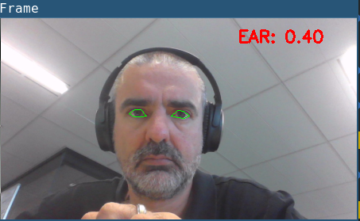
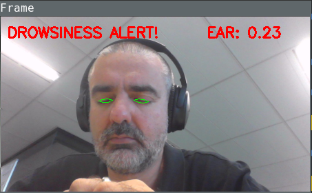

# Dedrowse is a drowsiness detector

Dedrowse is a computer vision system that can automatically detect operator
drowsiness in a real-time video stream and raise an alarm if the operator seems
to be drowsy. A operator may be a truk driver or a crane operator, or long
distance driver. Or a elite athlete training in the cut-throut world of competitive
netflix binge watching.

  


```
Usage: dedrowse [OPTIONS]

  Dedrowse daemon

Options:
  -p, --shape-predictor TEXT  Path to facial landmark predictor, Default: data/face.dat
  -s, --set-alarm TEXT        Sound the Alarm, Default: True
  --alarm-sound TEXT          Alarm sound file,, Default: /home/thys/workspace
                              /dedrowse/src/dedrowse/data/alarm.wav
  -w, --webcam TEXT           Path to webcam, Default:
  --help                      Show this message and exit.
```

# Install

This system is built arround opencv, numpy and scipy. On Arch its important to use the 
pre-built Python wrappers that supports the FFMpeg video stream handling. So use the sytem
site packages as installed by pacman. Not python-opencv that ships a pre-built opencv lib in the
wheel that does not have mgeg video streaming support compiled in.

# System dependencies                                                                                              
                                                                                                                    
Arch Linux:                                                                                                         
                                                                                                                    
```bash                                                                                                             
$ sudo pacman -S cmake boost
```                                                                                                                 

## Development 

```bash                                                                                                             
$ mkvirtualenv --system-site-packages dedrowse
$ pip install -r requirement.txt
$ pip install -e .
```                                                                                                                 

                                                                                                                    
# Resources                                                                                                         
                                                                                                                    
* Built on work from http://www.pyimagesearch.com/2017/05/08/drowsiness-detection-opencv/
* https://vision.fe.uni-lj.si/cvww2016/proceedings/papers/05.pdf
* Alarm sounds from http://soundbible.com/tags-alarm.html


